# chap0x12 Bro网络入侵取证实验

## 1.环境配置：

kali上bro的版本2.5.5：

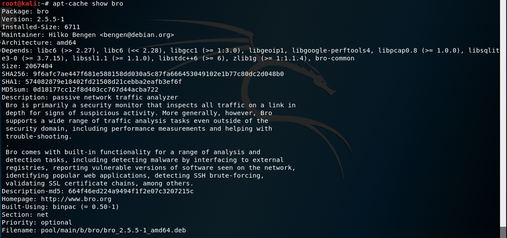

安装bro-aux：

```
apt-get install bro bro-aux
```

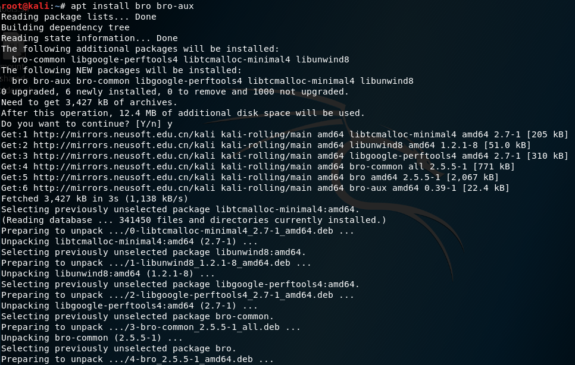

## 2.取证分析：

首先下载pcap至新建目录attack-trace，使用命令：

```
wget http://sec.cuc.edu.cn/huangwei/textbook/ns/chap0x12/attack-trace.pcap
```

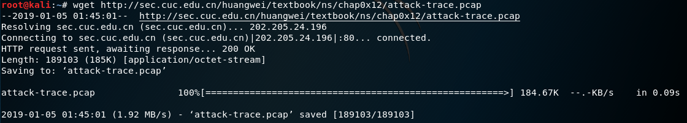

进入local.bro更改配置文件，如下，开启SMB应用层协议：

因为我们不希望对于bro的源文件有任何更改（但是在后面的实验中为了实验需要，我们必须对于默认设置进行更改），则对于本次实验，我们加载一个我们自己写bro文件，对于里面的某些值进行重定义。

加载文件mytuning.bro并且加载bro自带内置工具frameworks：

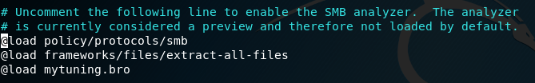

重定义：

在分析的过程中，为了避免校验值报错，忽略校验值。（老师在课上的实验是增加了一个防止内网报错的重定义，加不加影响不大，之前看了部分同学的实验报告，发现有的人ip地址和老师上课时候一样？应该是自己的内网ip吧）

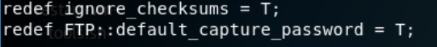

文件配置完毕后，bro自动化分析：

```
bro -r attack-trace.pcap /etc/bro/site/local.bro
```

分析完成后：

文件夹多出来了很多的log文件和一个extract_files的文件夹：

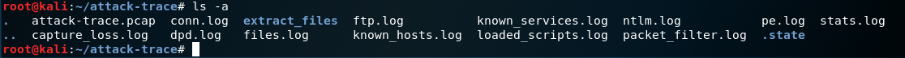

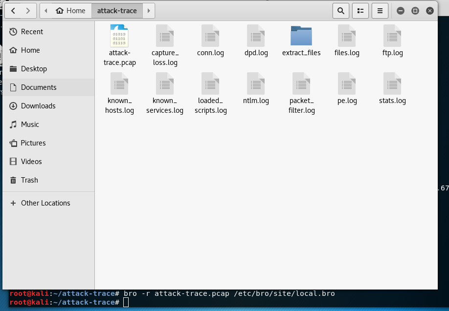

在extract_files中记录了可执行程序，如下图所示：是一个PE文件（结尾的为文件的唯一标识）：

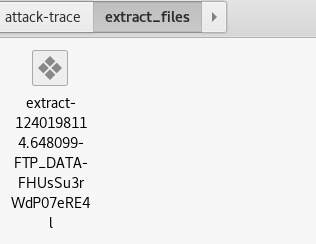

查看bro的源码。如下图，其中对于文件名的命名方式：

```
vi /usr/share/bro/base/files/extract/main.bro
```

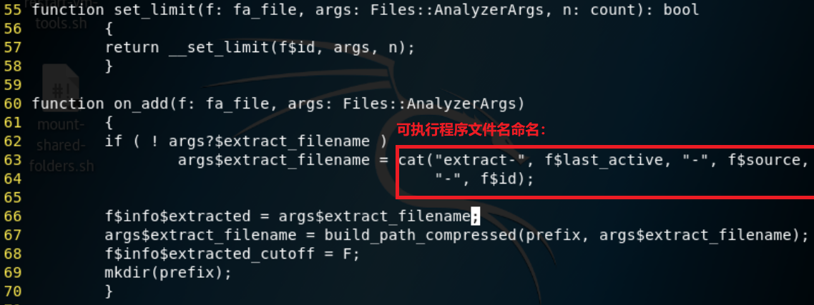

通过grep指令识别文件标识：

```
grep FHUsSu3rWdP07eRE4l -R
```

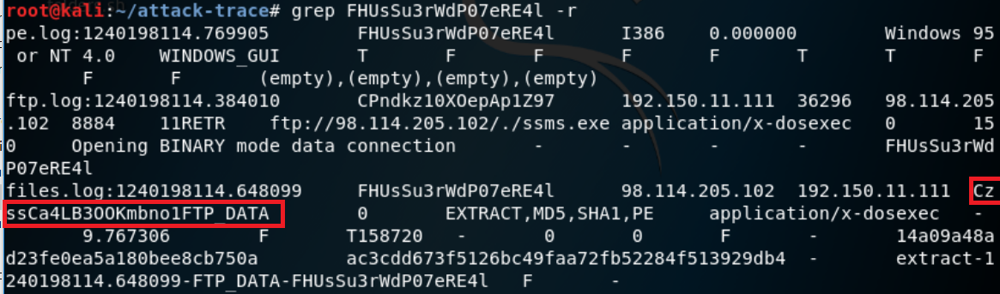

发现存在在多个日志中。

将PE文件上传至virustotal：哈希值匹配到为一个后门程序。（这里MD5或者SHA1也可以进行匹配）

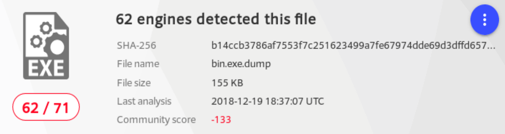

通过文件的后缀找到网络会话标识：CzssCa4LB300Kmbno1


再次查询该网络会话标识，conn.log中得到此次会话：

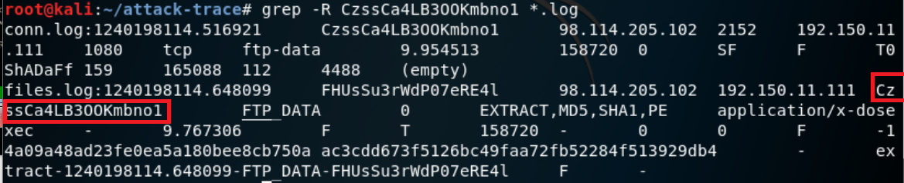

在默认设置中，密码不可见。由于之前设置了显示密码，则如下图所示：

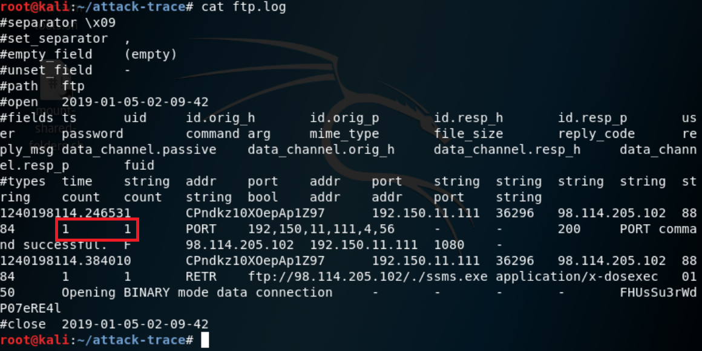

而我们在最初设置的时候，直接开启了SMB协议，因此有以下文件：

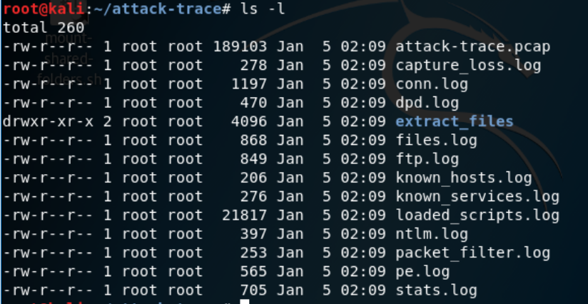

其他：关于查询TCP链接：window认证票据信息：

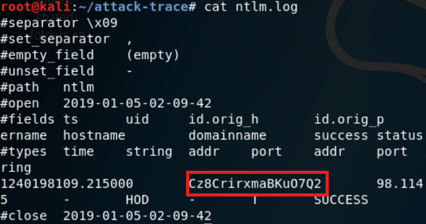

查询到是哪次的TCP链接：

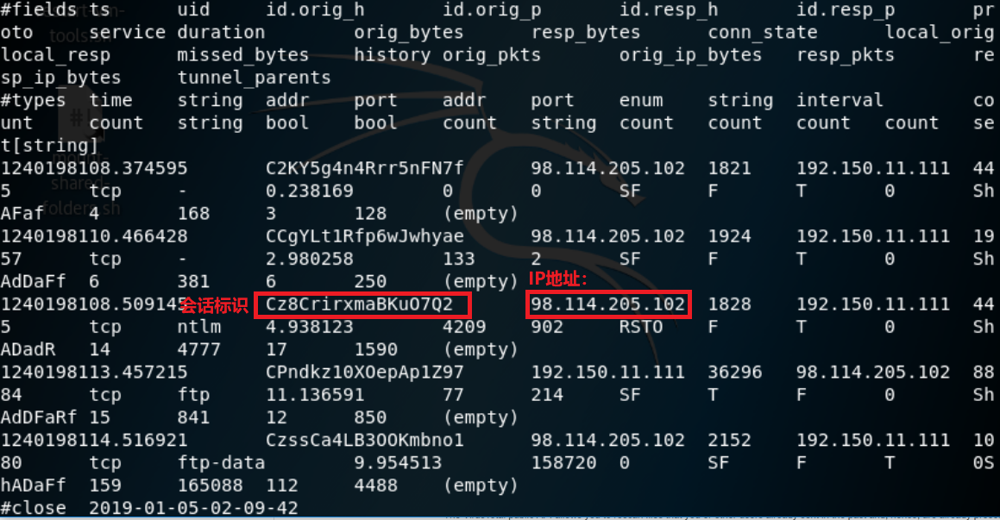

## 3.参考资料：

网络安全2018-12-21classroom replay

