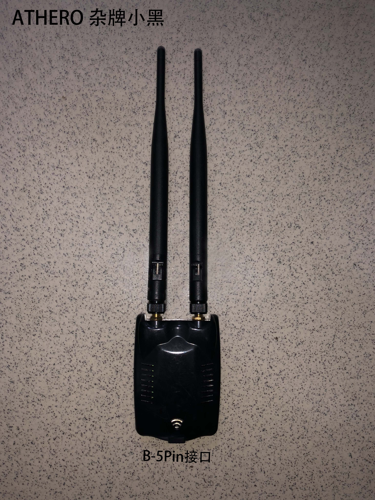

# ATHERO 无线网卡
## 一.网卡图片：

## 一.参数配置：
    Wiphy phy0
        max # scan SSIDs: 4
        max scan IEs length: 2257 bytes
        max # sched scan SSIDs: 0
        max # match sets: 0
        max # scan plans: 1
        max scan plan interval: -1
        max scan plan iterations: 0
        Retry short limit: 7
        Retry long limit: 4
        Coverage class: 0 (up to 0m)
        Device supports RSN-IBSS.
        Device supports T-DLS.
        Supported Ciphers:
            * WEP40 (00-0f-ac:1)
            * WEP104 (00-0f-ac:5)
            * TKIP (00-0f-ac:2)
            * CCMP-128 (00-0f-ac:4)
            * CCMP-256 (00-0f-ac:10)
            * GCMP-128 (00-0f-ac:8)
            * GCMP-256 (00-0f-ac:9)
            * CMAC (00-0f-ac:6)
            * CMAC-256 (00-0f-ac:13)
            * GMAC-128 (00-0f-ac:11)
            * GMAC-256 (00-0f-ac:12)
        Available Antennas: TX 0x1 RX 0x1
        Configured Antennas: TX 0x1 RX 0x1
        Supported interface modes:
            * IBSS
            * managed
            * AP
            * AP/VLAN
            * monitor
            * mesh point
            * P2P-client
            * P2P-GO
            * outside context of a BSS
        Band 1:
            Capabilities: 0x116e
                HT20/HT40
                SM Power Save disabled
                RX HT20 SGI
                RX HT40 SGI
                RX STBC 1-stream
                Max AMSDU length: 3839 bytes
                DSSS/CCK HT40
            Maximum RX AMPDU length 65535 bytes (exponent: 0x003)
            Minimum RX AMPDU time spacing: 8 usec (0x06)
            HT TX/RX MCS rate indexes supported: 0-7
            Bitrates (non-HT):
                * 1.0 Mbps
                * 2.0 Mbps (short preamble supported)
                * 5.5 Mbps (short preamble supported)
                * 11.0 Mbps (short preamble supported)
                * 6.0 Mbps
                * 9.0 Mbps
                * 12.0 Mbps
                * 18.0 Mbps
                * 24.0 Mbps
                * 36.0 Mbps
                * 48.0 Mbps
                * 54.0 Mbps
            Frequencies:
                * 2412 MHz [1] (20.0 dBm)
                * 2417 MHz [2] (20.0 dBm)
                * 2422 MHz [3] (20.0 dBm)
                * 2427 MHz [4] (20.0 dBm)
                * 2432 MHz [5] (20.0 dBm)
                * 2437 MHz [6] (20.0 dBm)
                * 2442 MHz [7] (20.0 dBm)
                * 2447 MHz [8] (20.0 dBm)
                * 2452 MHz [9] (20.0 dBm)
                * 2457 MHz [10] (20.0 dBm)
                * 2462 MHz [11] (20.0 dBm)
                * 2467 MHz [12] (20.0 dBm)
                * 2472 MHz [13] (20.0 dBm)
                * 2484 MHz [14] (disabled)
        Supported commands:
            * new_interface
            * set_interface
            * new_key
            * start_ap
            * new_station
            * new_mpath
            * set_mesh_config
            * set_bss
            * authenticate
            * associate
            * deauthenticate
            * disassociate
            * join_ibss
            * join_mesh
            * remain_on_channel
            * set_tx_bitrate_mask
            * frame
            * frame_wait_cancel
            * set_wiphy_netns
            * set_channel
            * set_wds_peer
            * tdls_mgmt
            * tdls_oper
            * probe_client
            * set_noack_map
            * register_beacons
            * start_p2p_device
            * set_mcast_rate
            * connect
            * disconnect
            * channel_switch
            * set_qos_map
            * set_multicast_to_unicast
        Supported TX frame types:
            * IBSS: 0x00 0x10 0x20 0x30 0x40 0x50 0x60 0x70 0x80 0x90 0xa0 0xb0 0xc0 0xd0 0xe0 0xf0
            * managed: 0x00 0x10 0x20 0x30 0x40 0x50 0x60 0x70 0x80 0x90 0xa0 0xb0 0xc0 0xd0 0xe0 0xf0
            * AP: 0x00 0x10 0x20 0x30 0x40 0x50 0x60 0x70 0x80 0x90 0xa0 0xb0 0xc0 0xd0 0xe0 0xf0
            * AP/VLAN: 0x00 0x10 0x20 0x30 0x40 0x50 0x60 0x70 0x80 0x90 0xa0 0xb0 0xc0 0xd0 0xe0 0xf0
            * mesh point: 0x00 0x10 0x20 0x30 0x40 0x50 0x60 0x70 0x80 0x90 0xa0 0xb0 0xc0 0xd0 0xe0 0xf0
            * P2P-client: 0x00 0x10 0x20 0x30 0x40 0x50 0x60 0x70 0x80 0x90 0xa0 0xb0 0xc0 0xd0 0xe0 0xf0
            * P2P-GO: 0x00 0x10 0x20 0x30 0x40 0x50 0x60 0x70 0x80 0x90 0xa0 0xb0 0xc0 0xd0 0xe0 0xf0
            * P2P-device: 0x00 0x10 0x20 0x30 0x40 0x50 0x60 0x70 0x80 0x90 0xa0 0xb0 0xc0 0xd0 0xe0 0xf0
        Supported RX frame types:
            * IBSS: 0x40 0xb0 0xc0 0xd0
            * managed: 0x40 0xd0
            * AP: 0x00 0x20 0x40 0xa0 0xb0 0xc0 0xd0
            * AP/VLAN: 0x00 0x20 0x40 0xa0 0xb0 0xc0 0xd0
            * mesh point: 0xb0 0xc0 0xd0
            * P2P-client: 0x40 0xd0
            * P2P-GO: 0x00 0x20 0x40 0xa0 0xb0 0xc0 0xd0
            * P2P-device: 0x40 0xd0
        software interface modes (can always be added):
            * AP/VLAN
            * monitor
        valid interface combinations:
            * #{ managed, P2P-client } <= 2, #{ AP, mesh point, P2P-GO } <= 2,
            total <= 2, #channels <= 1
        HT Capability overrides:
            * MCS: ff ff ff ff ff ff ff ff ff ff
            * maximum A-MSDU length
            * supported channel width
            * short GI for 40 MHz
            * max A-MPDU length exponent
            * min MPDU start spacing
        Device supports TX status socket option.
        Device supports HT-IBSS.
        Device supports SAE with AUTHENTICATE command
        Device supports low priority scan.
        Device supports scan flush.
        Device supports AP scan.
        Device supports per-vif TX power setting
        Driver supports full state transitions for AP/GO clients
        Driver supports a userspace MPM
        Device supports configuring vdev MAC-addr on create.