# 无线网卡监听实验

## 一.无线网卡的工作模式： 
- 1.Managed mode
- 2.AD hoc
- 3.Master mode
- 4.Monitor mode

在本实验中，由于需要监听空气中的数据包，需要打开监听模式（Monitor mode）,且无线网卡和驱动程序必须支持监听模式 

## 二.实验前环境搭建及实验工具： 
- 1.实验环境：linux kali
- 2.实验工具：无线网卡ATHERO，网线一根

## 三.实验原理： 
首先进行channel hopping，通过切换各个无线信道来达到识别无线网卡内的所有网络。当然在channel hopping时，会不可避免的丢失一些数据包，但是目的只是捕获beacons，识别范围内的SSID。
一旦我们选择了某个频率的固定信道，我们就可以对其进行监听

## 四.实验过程： 
首先开启网卡，查看模式为managed模式。需要更改为监听模式: 

 
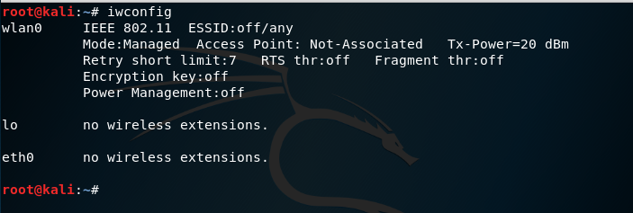
 

执行命令：check kill杀掉无关的导致异常的进程，更改模式为监听模式：

 
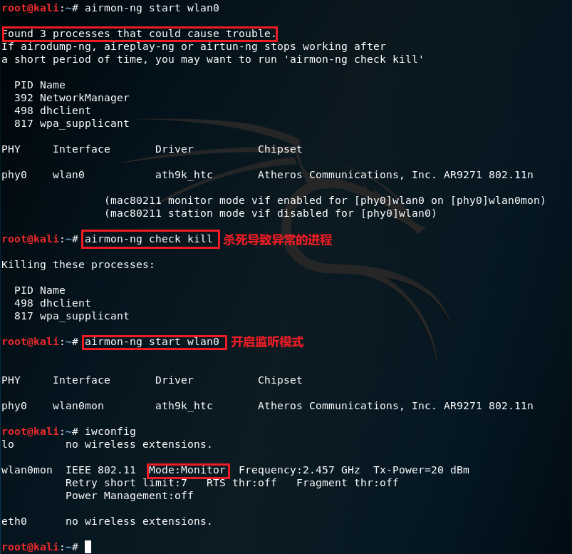
 

执行命令
    iw dev wlan0 scan | grep SSID | xargs -0 echo -e

查看附近范围内的SSID： 
 
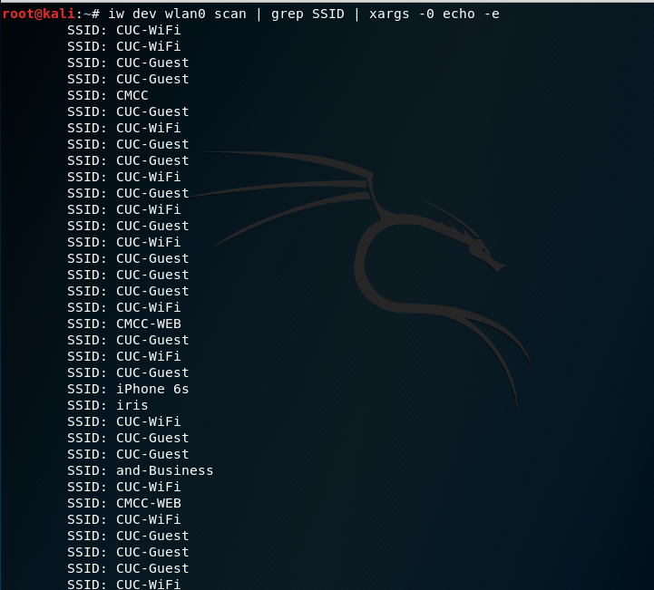
 

选择一个正在工作的忙碌的频道：

 
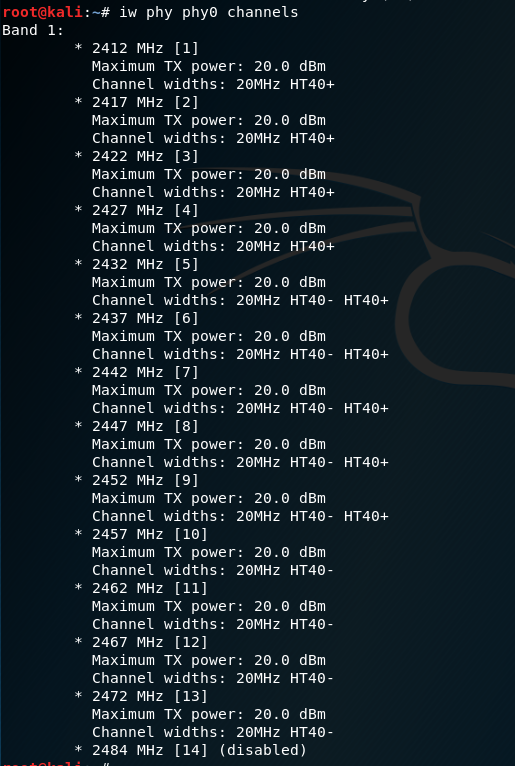
 

开始抓包：
 
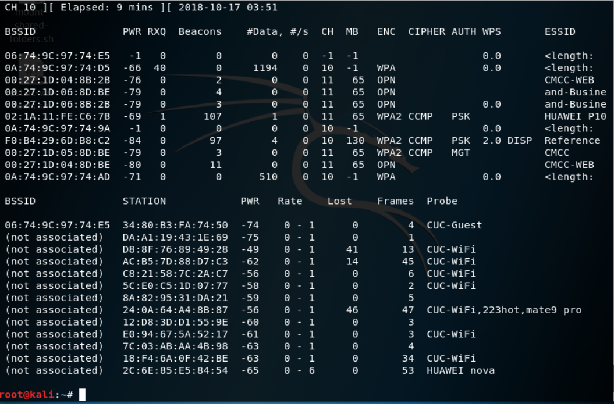
 

## 实验练习题：  
通过分析抓包保存的pcap文件： 
- 1.1 查看统计当前信号覆盖范围内一共有多少独立的SSID？ 
 
.PNG)
 

- 1.2 其中是否包括隐藏SSID？ 

隐藏的SSID韦恩图：
 

 

其中有隐藏的SSID（空串SSID）： 
 
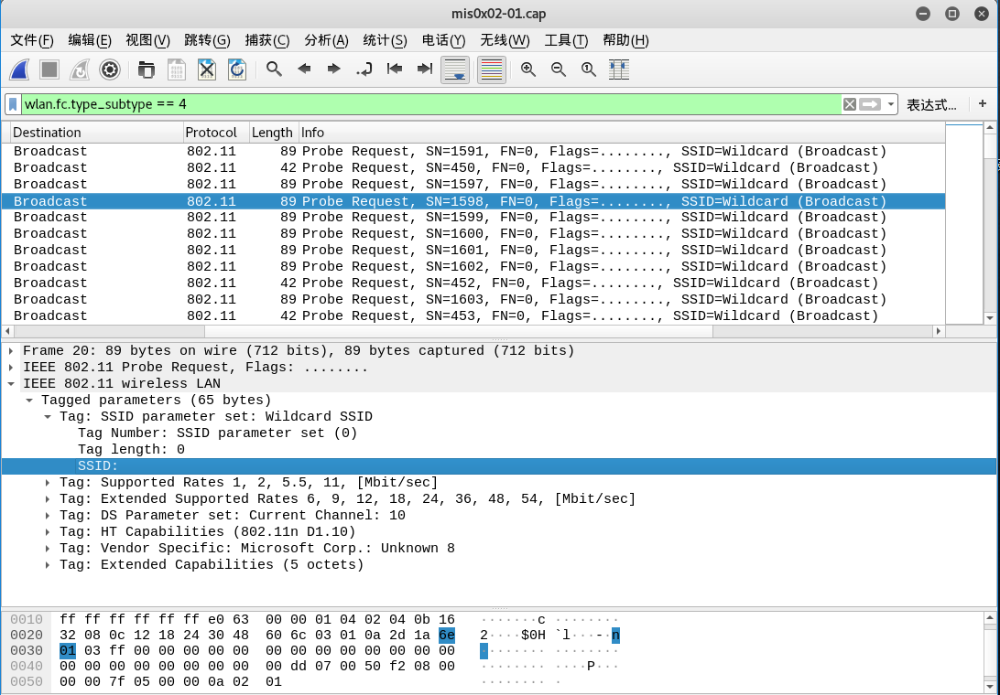
 

除了其中SSID名称为空的SSID，还存在不广播beacon包的SSID： 
所有的response包：
 
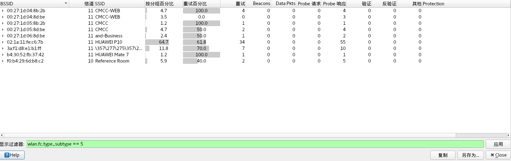
 

所有的beacon包：
 
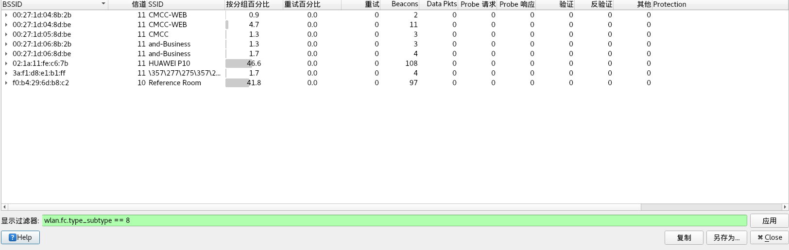
 

做集合的差运算得到：
发现其中的HUAWEI MATE7这个AP是没有广播beacon包但是却有response的。

- 1.3 哪些无线热点是加密/非加密的？加密方式是否可知？ 
通过Privacy字段的值判断是否加密：
这些无线热点是加密的（=1）： 
 
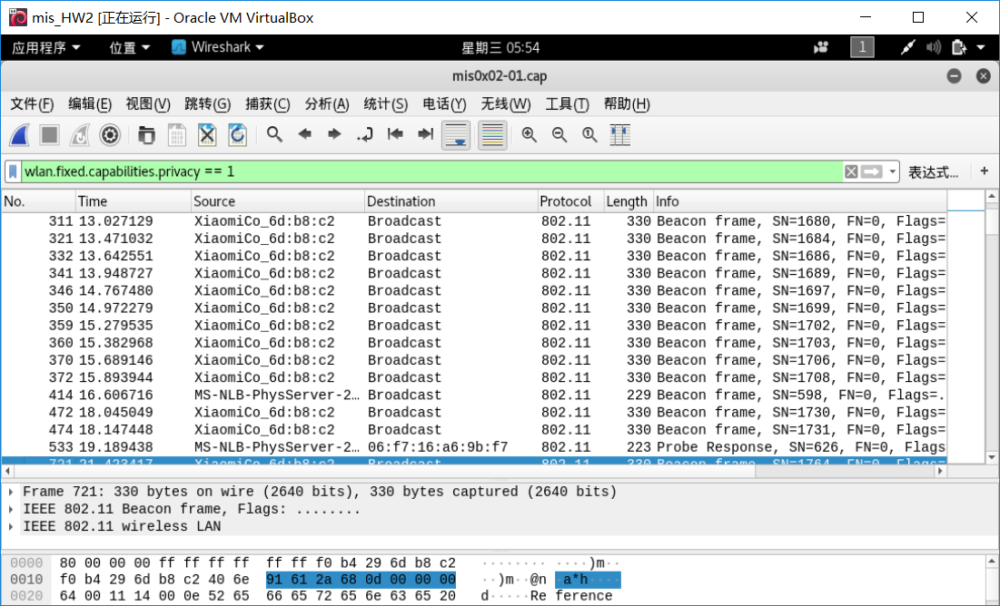
 

这些无线热点是非加密的（=0）： 
 
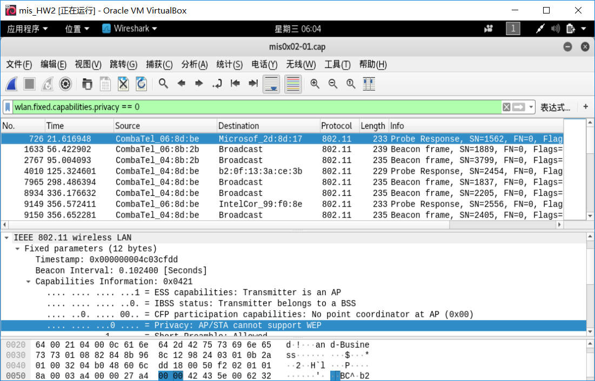
 

加密方式为WEP： 
 
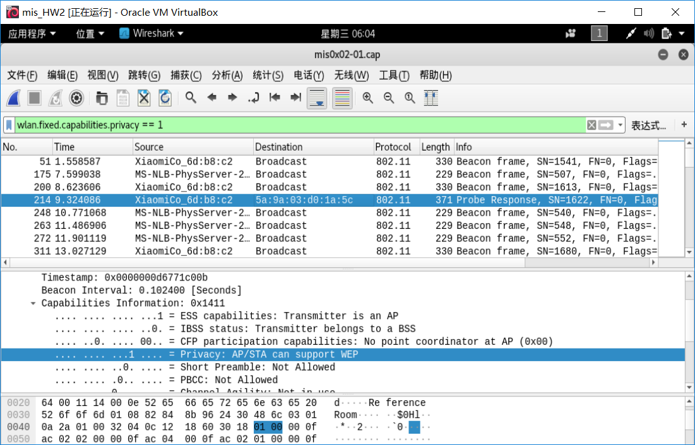
 

- 2.1 如何分析出一个指定手机在抓包时间窗口内在手机端的无线网络列表可以看到哪些SSID？///
我们随便选取一台苹果手机作为实验用例,只要此手机接收到来自AP的beacon frame则可以显示到手机上： 

 
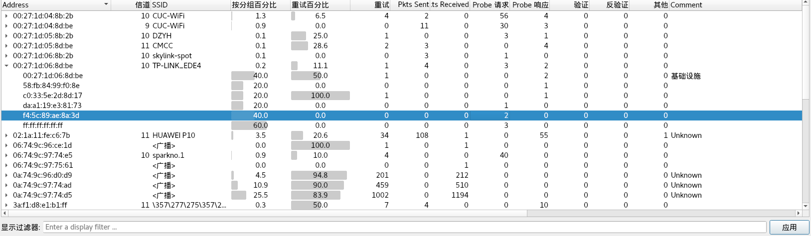
 

 
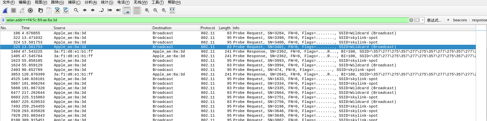
 

由上图可以看出，此台设备只接收到来自一个AP的beacon frame。
因此只能显示此SSID
- 2.2 这台手机尝试连接了哪些SSID？
尝试连接了TP-LINK_EDE4： 
这台手机尝试了向TP-LINK_EDE4(3a:f1:d8:e1:b1:ff)进行连接： 
 
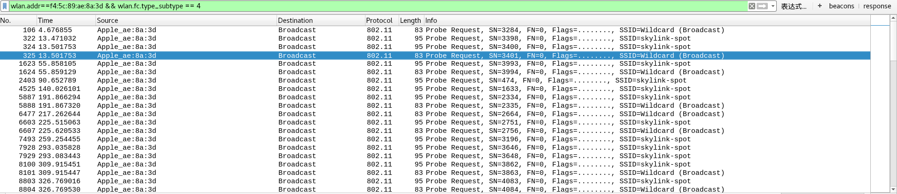
 

- 2.3 最终加入了哪些SSID？
最终没有加入任何的SSID：
 
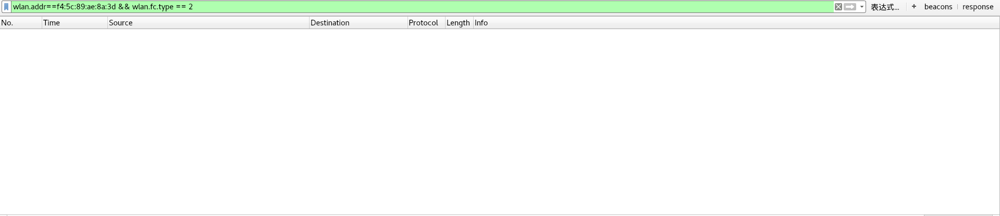
 

- 3. SSID包含在哪些类型的802.11帧？ 
Association request frame中包含SSID字段：
 
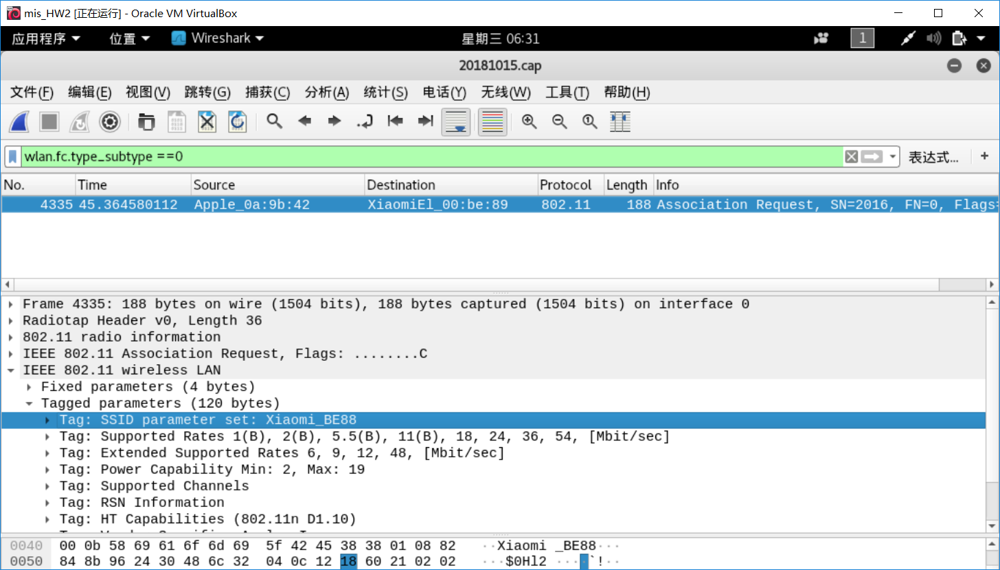
 

Probe request frame中包含SSID字段：
 
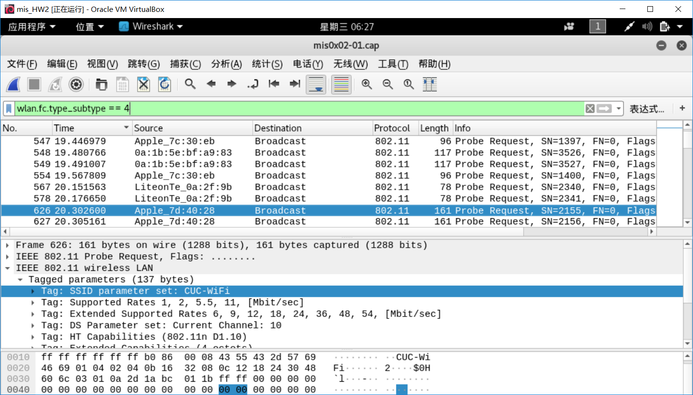
 

Probe Response frame中包含SSID字段：
 
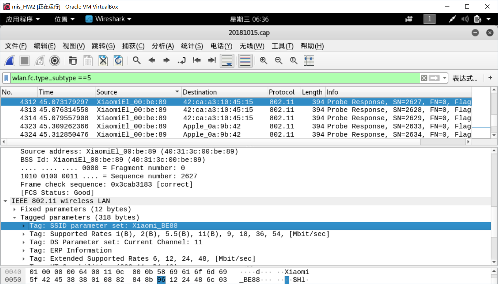
 

beacon frame中包含SSID字段：
 
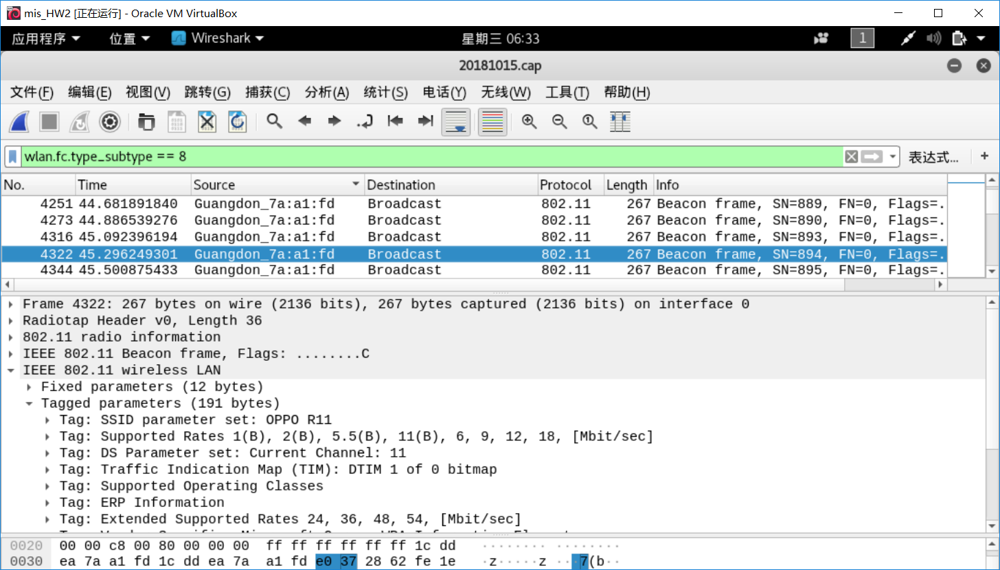
 

除这些以外的其他帧，都没有SSID。

## 五.参考资料及实验过程中遇到的小问题： 
~~~刚刚开始做实验的时候，无法识别到无线网卡，会报一个请求忙碌的错误，不知道是不是本身不支持某些功能/驱动（猜测不支持USB3.0）？~~~
不算是什么问题，已解决。

### 参考资料：
1.https://github.com/CUCCS/2018-NS-Public-cloud0606/tree/mis_02/Mobile%20Internet%20Security/mis_0x02

2.https://wiki.wireshark.org/CaptureSetup/WLAN#Channel_Hopping