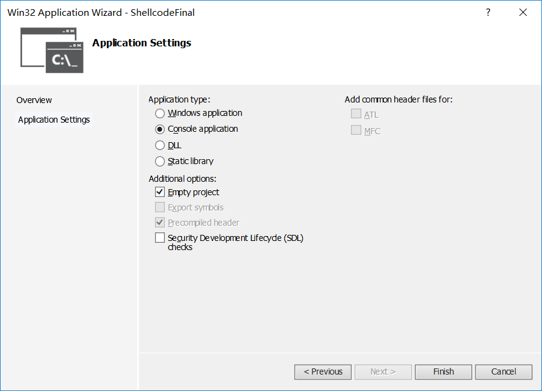
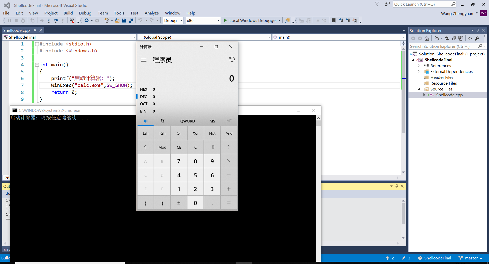
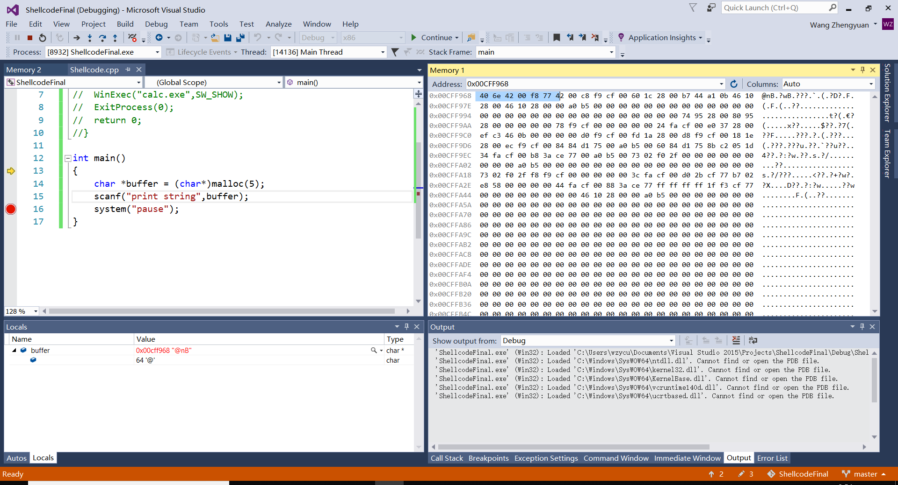
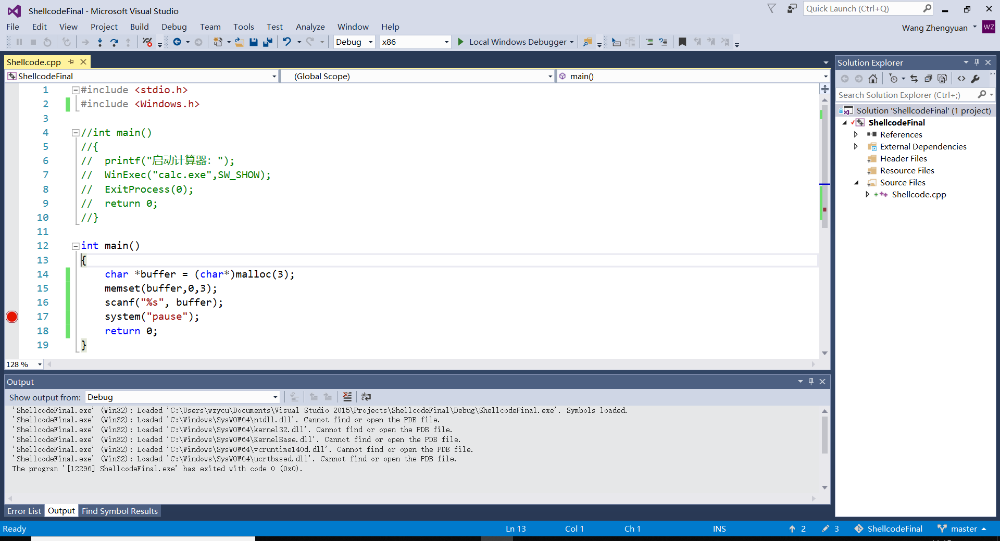

# Shellcode的分析及缓冲区溢出漏洞利用

201611123001 

## 零.什么是Shellcode？

**Shellcode通常配合缓冲区溢出漏洞一起“食用”**

通常我们利用缓冲区的溢出，在函数返回部分（既return处）填入Shellcode使得Shellcode可以被执行。

Shellcode实际是一段代码（也可以是填充数据），是用来发送到服务器利用特定漏洞的代码，一般可以获取权限。另外，Shellcode一般是作为数据发送给受攻击服务器的。 Shellcode是溢出程序和蠕虫病毒的核心，提到它自然就会和漏洞联想在一起，毕竟Shellcode只对没有打补丁的主机有用武之地。网络上数以万计带着漏洞顽强运行着的服务器给hacker和Vxer丰盛的晚餐。漏洞利用中最关键的是Shellcode的编写。由于漏洞发现者在漏洞发现之初并不会给出完整Shellcode，因此掌握Shellcode编写技术就显得尤为重要。

## 一.配置实验环境

Windows 10

Vistual Studio‘

新建工程时对于安全性勾选：



## 二.缓冲区溢出漏洞

### 缓冲区：

一、什么是缓冲区

缓冲区(buffer)，它是内存空间的一部分。也就是说，在内存空间中预留了一定的存储空间，这些存储空间用来缓冲输入或输出的数据，这部分预留的空间就叫做缓冲区，显然缓冲区是具有一定大小的。

缓冲区根据其对应的是输入设备还是输出设备，分为输入缓冲区和输出缓冲区。

二、为什么要引入缓冲区

我们为什么要引入缓冲区呢？

高速设备与低速设备的不匹配，势必会让高速设备花时间等待低速设备，我们可以在这两者之间设立一个缓冲区。

缓冲区的作用：

1.可以解除两者的制约关系，数据可以直接送往缓冲区，高速设备不用再等待低速设备，提高了计算机的效率。例如：我们使用打印机打印文档，由于打印机的打印速度相对较慢，我们先把文档输出到打印机相应的缓冲区，打印机再自行逐步打印，这时我们的CPU可以处理别的事情。

2.可以减少数据的读写次数，如果每次数据只传输一点数据，就需要传送很多次，这样会浪费很多时间，因为开始读写与终止读写所需要的时间很长，如果将数据送往缓冲区，待缓冲区满后再进行传送会大大减少读写次数，这样就可以节省很多时间。例如：我们想将数据写入到磁盘中，不是立马将数据写到磁盘中，而是先输入缓冲区中，当缓冲区满了以后，再将数据写入到磁盘中，这样就可以减少磁盘的读写次数，不然磁盘很容易坏掉。

简单来说，缓冲区就是一块内存区，它用在输入输出设备和CPU之间，用来存储数据。它使得低速的输入输出设备和高速的CPU能够协调工作，避免低速的输入输出设备占用CPU，解放出CPU，使其能够高效率工作。

三、缓冲区的类型

缓冲区 分为三种类型：全缓冲、行缓冲和不带缓冲。

1、全缓冲

在这种情况下，当填满标准I/O缓存后才进行实际I/O操作。全缓冲的典型代表是对磁盘文件的读写。

2、行缓冲

在这种情况下，当在输入和输出中遇到换行符时，执行真正的I/O操作。这时，我们输入的字符先存放在缓冲区，等按下回车键换行时才进行实际的I/O操作。典型代表是键盘输入数据。

3、不带缓冲

也就是不进行缓冲，标准出错情况stderr是典型代表，这使得出错信息可以直接尽快地显示出来。

四、缓冲区的刷新

下列情况会引发缓冲区的刷新:

缓冲区满时；
关闭文件。

## 缓冲区溢出：

### 概念：
​        计算机程序一般都会使用到一些内存，这些内存或是程序内部使用，或是存放用户的输入数据，这样的内存一般称作缓冲区。溢出是指盛放的东西超出容器容量而溢出来了，在计算机程序中，就是数据使用到了被分配内存空间之外的内存空间。而缓冲区溢出，简单的说就是计算机对接收的输入数据没有进行有效的检测（理想的情况是程序检查数据长度并不允许输入超过缓冲区长度的字符），向缓冲区内填充数据时超过了缓冲区本身的容量，而导致数据溢出到被分配空间之外的内存空间，使得溢出的数据覆盖了其他内存空间的数据。
### 危害：
​        在计算机安全领域，缓冲区溢出就好比给自己的程序开了个后门，这种安全隐患是致命的。缓冲区溢出在各种操作系统、应用软件中广泛存在。而利用缓冲区溢出漏洞实施的攻击就是缓冲区溢出攻击。缓冲区溢出攻击，可以导致程序运行失败、系统关机、重新启动，或者执行攻击者的指令，比如非法提升权限。
在当前网络与分布式系统安全中，被广泛利用的50%以上都是缓冲区溢出，其中最著名的例子是1988年利用fingerd漏洞的蠕虫。而缓冲区溢出中，最为危险的是堆栈溢出，因为入侵者可以利用堆栈溢出，在函数返回时改变返回程序的地址，让其跳转到任意地址，带来的危害一种是程序崩溃导致拒绝服务，另外一种就是跳转并且执行一段恶意代码，比如得到shell，然后为所欲为。

### 原理：

​        通过往程序的缓冲区写超出其长度的内容，造成缓冲区的溢出，从而破坏程序的堆栈，造成程序崩溃或使程序转而执行其它指令，以达到攻击的目的。造成缓冲区溢出的原因是程序中没有仔细检查用户输入的参数。
下面通过一个示例来详细看看什么是缓冲区溢出。程序的缓冲区就像一个个格子，每个格子中存放不同的东西，有的是命令，有的是数据，当程序需要接收用户数据，程序预先为之分配了4个格子（下图1中黄色的0~3号格子）。按照程序设计，就是要求用户输入的数据不超过4个。而用户在输入数据时，假设输入了16个数据，而且程序也没有对用户输入数据的多少进行检查，就往预先分配的格子中存放，这样不仅4个分配的格子被使用了，其后相邻的12个格子中的内容都被新数据覆盖了。这样原来12个格子中的内容就丢失了。这时就出现了缓冲区（0~3号格子）溢出了。

缓冲区是一块连续的计算机内存区域，例如在VS中分配一个定长的buffer内存。可保存相同数据类型的多个实例。缓冲区可以是堆栈(自动变量)、堆(动态内存)和静态数据区(全局或静态)。在C/C++语言中，通常使用字符数组和malloc/new之类内存分配函数实现缓冲区。溢出指数据被添加到分配给该缓冲区的内存块之外。缓冲区溢出是最常见的程序缺陷。

​     栈帧结构的引入为高级语言中实现函数或过程调用提供直接的硬件支持，但由于将函数返回地址这样的重要数据保存在程序员可见的堆栈中，因此也给系统安全带来隐患。若将函数返回地址修改为指向一段精心安排的恶意代码，则可达到危害系统安全的目的。此外，堆栈的正确恢复依赖于压栈的EBP值的正确性，但EBP域邻近局部变量，若编程中有意无意地通过局部变量的地址偏移窜改EBP值，则程序的行为将变得非常危险。

​     由于C/C++语言没有数组越界检查机制，当向局部数组缓冲区里写入的数据超过为其分配的大小时，就会发生缓冲区溢出。攻击者可利用缓冲区溢出来窜改进程运行时栈，从而改变程序正常流向，轻则导致程序崩溃，重则系统特权被窃取。

### 分类：

缓冲区溢出根据溢出的内存类型分为:

**栈溢出(stackoverflow)**
​         栈内的数据溢出。
**堆溢出(heap overflow)**
​         堆内的数据溢出, 
根据溢出的类型可分为overflow及underflow
overflow,写入的数据超过了缓冲的边界
underflow, 缓冲中有用数据的大小小于缓冲区长度,这有可能造成脏数据的问题

## 三.如何通过溢出使得控制权

### 缓冲区溢出：

```c
int main()
{
	char *buffer = (char*)malloc(3);
	memset(buffer,0,3);
	scanf("%s", buffer);
	system("pause");
	return 0;
}
```

当输入字符大于3个时，发生缓冲区溢出漏洞。

### 提取机器码：

```shell
"/x55/x8B/xEC/x33"
"/xC0/x50/xB8/x2E"
"/x65/x78/x65/x50"
"/xB8/x63/x61/x6C"
"/x63/x50/x8B/xC4"
"/x6A/x05/x50/xB8"
"/xAD/x23/x86/x7C"
"/xFF/xD0/x33/xC0"
"/x50/xB8/xFA/xCA"
"/x81/x7C/xFF/xD0"
"/x8B/xE5/x5D/x33"
```

### 弹出计算器：



### 查看内存：



### 实验代码：



## 四.缓冲区溢出漏洞防范

### 使用安全的库函数：

例如不使用不安全的printf和scanf函数

在使用例如strcpy函数时，也会发生缓冲区溢出

改用最新的微软scanf_s，printf_s等安全的函数

### 做边界检查（安全的库函数）：

​        防范缓冲区溢出问题的准则是：确保做边界检查(通常不必担心影响程序效率)。不要为接收数据预留相对过小的缓冲区，大的数组应通过malloc/new分配堆空间来解决；在将数据读入或复制到目标缓冲区前，检查数据长度是否超过缓冲区空间。

### 使用安全的编程语言：

​        若有可能，改用具备防止缓冲区溢出内置机制的高级语言(Java、C#等)。但许多语言依赖于C库，或具有关闭该保护特性的机制(为速度而牺牲安全性)。其次，可以借助某些底层系统机制或检测工具(如对C数组进行边界检查的编译器)。许多操作系统(包括Linux和Solaris)提供非可执行堆栈补丁，但该方式不适于这种情况：攻击者利用堆栈溢出使程序跳转到放置在堆上的执行代码。此外，存在一些侦测和去除缓冲区溢出漏洞的静态工具(检查代码但并不运行)和动态工具(执行代码以确定行为)，甚至采用grep命令自动搜索源代码中每个有问题函数的实例。

​     但即使采用这些保护手段，程序员自身也可能犯其他许多错误，从而引入缺陷。例如，当使用有符号数存储缓冲区长度或某个待读取内容长度时，攻击者可将其变为负值，从而使该长度被解释为很大的正值。经验丰富的程序员还容易过于自信地"把玩"某些危险的库函数，如对其添加自己总结编写的检查，或错误地推论出使用潜在危险的函数在某些特殊情况下是"安全"的。

## 五.软件安全：

​        **除了缓冲区溢出漏洞，在软件的开发时还有其他的各种各样的漏洞**

​        没有一款软件或平台敢说自己是绝对安全的。软件漏洞永远存在,我们的目的是通过细致的软件设计,良好的编码,发现漏洞后快速的响应来尽量减少软件漏洞的产生,以及降低漏洞被利用后所带来的危害。

​        **几种最常见的漏洞的来源。**

​        **一:缓冲区溢出(buffer overflows)**

​        略，如上所示：

​        **二:未验证输入(Unvalidated Input)** 

​        一款应用往往需要接收各种各样的输入,主要的输入有读取文件,读取用户输入,读取网络传输数据,或通过URL被启动(URL Schema)。各种类型的输入都有可能是非法的,甚至是恶意的,所以针对所有类型的输入,应用都要进行检验,确保输入的数据是符合程序要求的,合理的,合法的数据。非法输入可能造成的危害主要有:
输入的数据大于接收缓冲,会造成缓冲溢出
格式化字符串注入,对这些字符串进行处理时,如果不小心会造成程序的崩溃,或某些敏感数据被篡改
URLSchema中的命令为恶意命令,执行了恶意的命令
代码注入,输入的URL或命令中带有脚本、代码等恶意片段

​        **三:竞争条件(Race Condtions)** 

​        如果一个任务的完成需要几个特定的子任务以特定的顺序完成来完成,那么这个任务就是存在竞争条件这个漏洞的。黑客可以通过修改事件完成的顺序来改变应用的行为。竞争条件类型的漏洞主要有以下两种:
Time of Check Versus Time of Use (TOCTOU)
​        应用运行的过程中,在某个操作之前,比如写文件,都会检查一下文件是否存在,在检查与真正的写入之间的间隔就是一个可以被利用的Race Condition,恶意软件可以将用户检查的文件替换成自己的文件,这样数据就泄露了。
Signal Handling
​         处理信号的过程中,是随时可以被另一个信号的处理打断的,如果在处理一个信号的过程中另一个信号到来,那么这个过程会被马上中断,这样,系统就会处于一种未知的状态。 

​        **四:进程间通信(Interprocess Communication)**

​        进程间通信采用的方法很多,共享内存,管道,油槽等,由于通信管道两端的应用的不同,那么,有可能存在这钟管道被恶意利用的肯能性,也就是说,进程间通信也是软件漏洞的一个来源,当与另一个应用通信的时候,要默认此应用是不安全的,要对通信的内容进行安全方面的验证。 

​        **五:不安全的文件操作(Insecure File Operation)**

​        应用对文件进行处理时,若果没有进行进行有效的验证,那么有可能处理的文件已经是被恶意软件修改过的,是不安全的。所以,进行有效的验证是安全处理文件的重要保证。

不安全文件操作类型有以几种:

- 读取或写入一个位于其他应用也拥有读写权限路径下的文件。
- 对文件信息,例如权限等信息没有进行有效验证便进行处理。
- 对文件操作的返回结果没有进行有效利用。
- 假定一个拥有本地文件名的文件就是真正的本地文件。

​        **六:权限控制问题(Access Control)**

​        很多情况下,权限控制是安全机制保证的核心,同时也是漏洞的主要来源。每个应用都有与其匹配的权限,应用申请的权限应该物尽其用,不能申请超过自身需求的权限,而很多的软件漏洞就是因为应用申请了超过自身需求的权限,比如root权限,然后被恶意软件利用,也就有了对整个系统执行所有操作的权限。很多情况下,对权限的申请进行验证是明智的选择,例如输入用户名及密码来提升权限。注意,在采用验证机制时,最好使用系统内置的权限验证方法,而不是自己取实现,这里需要额外提一下,权限控制是操作系统级别的,当硬件设备被控制时,各种权限的控制也就显得无力,这种情况下,数据的加密保护就显现出了其价值。 

​        **七:文件的安全存储与加密(Secure Storage and Encryption)**

​        安全机制方面尽量使用系统自带的机制,在安全性与可靠性上,系统提供机制往往比自身实现的加密保护机制要可靠的多。 
​        **八:社会工程(Social Engineering)**

​        用户往往是安全保证机制中那薄弱的一环。即使提供再强大的安全保全机制,如果用户安全意识薄弱,同样会出现问题。很简单的例子,比如用户将密码设置的非常复杂,服务器端数据库的安全保证也很周全,黑客完全无法通过技术手段窃取用户密码,可黑客一个伪装客服的电话就完全有可能将用户的密码从用户的口中骗取到。这就是所谓的“社会工程”. 在界面,使用习惯上教育,引导用户进行安全的操作,也是软件设计的重中之重
