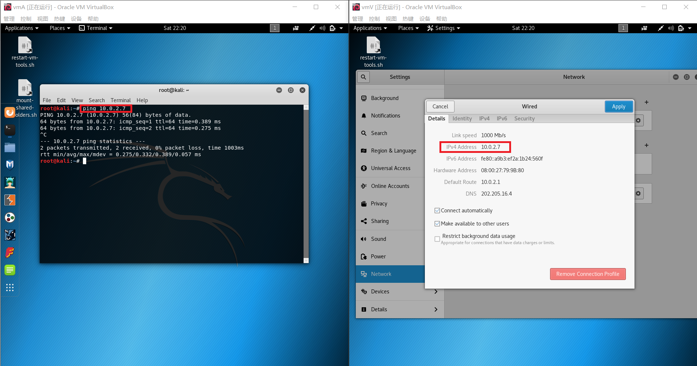
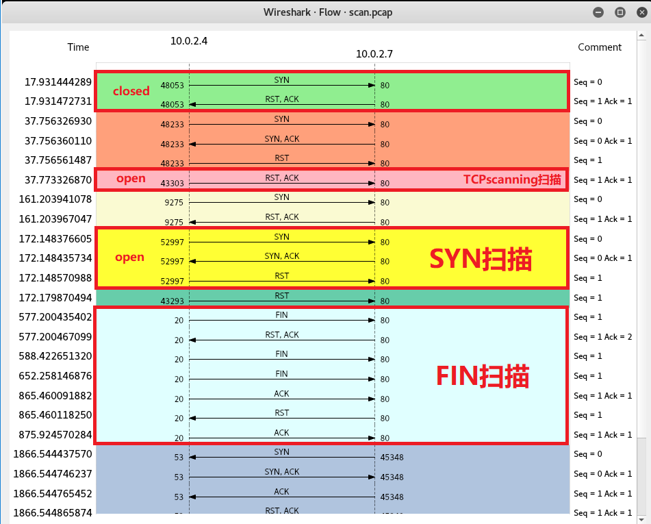

# chap0x05 TCP/UDP/Port Scanning

## 一.实验目的&实验背景：

**实验目的：**

通过Scapy构造相关的包来对靶机进行各种扫描，来收集靶机的相关信息。

**实验背景：**

端口扫描：

- 1.开放扫描：
    - TCP连接扫描：利用三次握手和服务器端建立通信，且有RST回应
    - UDP扫描：无连接协议扫描，通过返回不同的状态码来判断端口是否是关闭/过滤
- 2.半开放扫描：
    - TCP SYN扫描：不进行第三次握手，只发送RST至服务器端。
- 3.隐蔽扫描：
    - TCP FIN扫描：发送FIN和端口号来查看服务器端口是否开放/关闭/被过滤
    - TCP XMAS扫描：设置FIN，URG，PSH标志位来判断端口是否开放/关闭/被过滤
    - TCP NULL扫描：只发送要扫描的端口号，判断端口是否开放/关闭/被过滤
    - TCP ack扫描：发送ACK和端口号用以检测是否有状态防火墙，无法判断端口开放还是关闭

总结：返回RST端口关闭，返回错误码存在防火墙（ping某一个端口时除外）

## 二.实验环境：

工具：虚拟机VirtualBox两台，Scapy-python3等扫描工具，tshark等抓包工具。

搭建的网络拓扑结构：其中PC0为攻击者，PC1为靶机。


两者在同一网段内，且能相互ping通：



## 三.实验过程：

### 0.开启tshark抓包：

```
tshark -i eth0 -w scan.pcap
```


### 1.TCP 连接扫描：

**控制变量：开放/关闭80端口**，区分端口是否开放。

TCP连接扫描，首先对于靶机不开放80端口，进行扫描。

使用命令对80端口进行监听：

```
nc -l -p 80 
```

之后再次进行扫描：可以看到使用Scapy扫描的结果不同：


结果由closed变为open。

第一个代码注释的比较多，后面基本上差不多注释就不标注了：


### 2.UDP扫描：

**控制变量：开放/关闭53端口，过滤/不过滤53端口，DROP和REJECT的区别**

首先对于靶机，开放&不过滤，进行扫描：结果如下图

然后，关闭&不过滤，进行扫描：打印closed

再然后，（开放/关闭）&过滤**REJECT**，进行扫描：

最后，丢掉所有包**DROP**不进行回复，进行扫描（不能判断是端口开放还是被过滤（默认状态：端口处于监听且不回复））：服务器端无响应，打印open|filtered


代码：


### 3.TCP SYN扫描：

**控制变量：开放/关闭80端口**（同TCP连接扫描）


代码：


### 4.TCP FIN扫描：

**控制变量：开放/关闭80端口，过滤80端口**

开放/关闭80端口同TCP连接扫描：


然后对端口进行过滤，扫描，显示结果不同。

代码：


### 5.TCP XMAS扫描：

**控制变量：同FIN扫描**

实验过程同FIN扫描。

代码：


### 6.TCP NULL扫描：

**控制变量：同FIN扫描。**

实验过程同FIN扫描。

代码：


### 7.TCP ack扫描：

与上述实验不同的是，ACK扫描没有控制端口的开放和关闭。

**控制变量：80端口过滤/非过滤**

首先扫描：如下图

然后对80端口进行过滤：开启iptables后，显示存在防火墙。


代码：


### Flow图：

第一张图是进行连接扫描，隐蔽扫描和fin扫描的

可以明显看到closed和open在三次握手中是不同的，open成功建立了TCP连接。



UDP扫描：


## 四.参考资料：

实验报告：https://github.com/CUCCS/2018-NS-Public-cloud0606/blob/ns_0x05/ns_0x05/chap0x05%20网络扫描.md

INFOSEC institute：https://resources.infosecinstitute.com/port-scanning-using-scapy/


